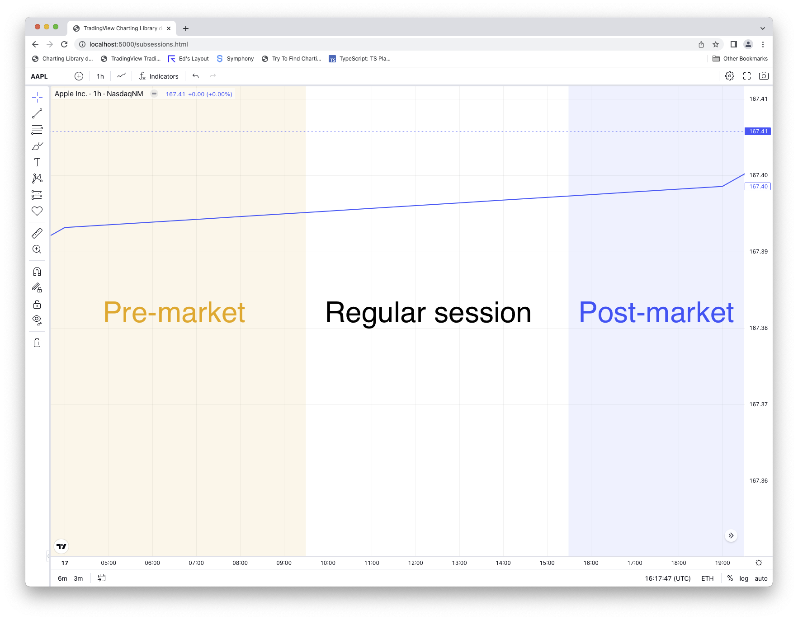
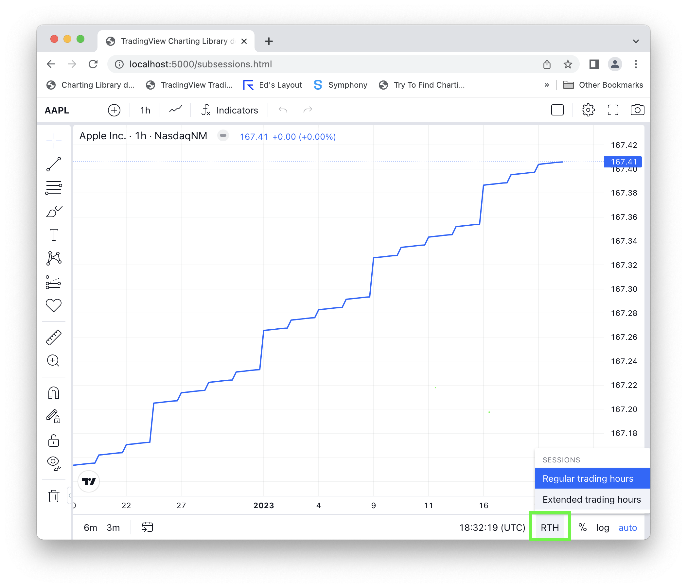
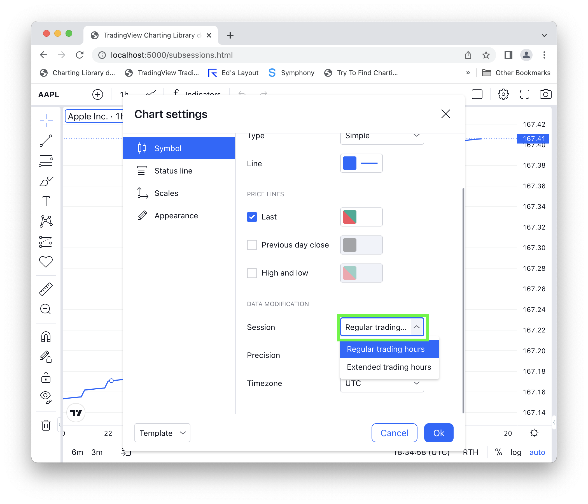

# Extended Sessions



Available since version 23.040.

The library is able to display extended trading sessions for symbols that have them.

Extended sessions are only visible on intraday resolutions.

## How to change the session

As a user the session can be changed in 2 places in the UI:

### In the bottom toolbar



### In the series properties dialog



## Enabling extended sessions

Add `'pre_post_market_sessions'` to your list of enabled features.

For each symbol that supports extended sessions you will need to add the [`subsession_id`](Symbology#session) and [`subsessions`](Symbology) fields to the symbol info object.

The extended session feature expects a certain number of subsessions with specific `'id'`s.

## Example symbol info

Given the this symbol info object without subsession information:

```json
{
    "name": "AAPL",
    "ticker": "AAPL",
    "full_name": "NasdaqNM:AAPL",
    "exchange": "NasdaqNM",
    "timezone": "Etc/UTC",
    "description": "Apple Inc.",
    "type": "stock",
    "pricescale": 100,
    "minmov": 1,
    "has_intraday": true,
    "supported_resolutions": ["60"],
    "has_daily": false,
    "intraday_multipliers": ["1"],
    "format": "price",
    "session": "0930-1600"
}
```

Add the `'subsession_id'` and `'subsessions'` properties. In this example we have a pre-market session from 04:00 to 09:30, and a post-market session from 16:00 to 20:00.

```json
{
    "name": "AAPL",
    "ticker": "AAPL",
    "full_name": "NasdaqNM:AAPL",
    "exchange": "NasdaqNM",
    "timezone": "Etc/UTC",
    "description": "Apple Inc.",
    "type": "stock",
    "pricescale": 100,
    "minmov": 1,
    "has_intraday": true,
    "supported_resolutions": ["60"],
    "has_daily": false,
    "intraday_multipliers": ["1"],
    "format": "price",
    "session": "0930-1600",
    "subsession_id": "regular",
    "subsessions": [
        {
            "description": "Regular Trading Hours",
            "id": "regular",
            "session": "0930-1600"
        },
        {
            "description": "Extended Trading Hours",
            "id": "extended",
            "session": "0400-2000"
        },
        {
            "description": "Premarket",
            "id": "premarket",
            "session": "0400-0930"
        },
        {
            "description": "Postmarket",
            "id": "postmarket",
            "session": "1600-2000"
        }
    ]
}
```

**Important**: All 3 `'extended'`, `'premarket'`, and `'postmarket'` subsession ids must be defined.

**Important**: the value of the top-level `'session'` property should be equal to the value in the `'session'` property for the `'subsession_id'`. In other words the following expression should always be `true`:

```javascript
symbolInfo.session === symbolInfo.subsessions.find(x => x.id === subsession_id).sesssion
```

## Example of resolved symbol infos when switching to the extended session

Given the the library has [resolved](JS-Api#resolvesymbolsymbolname-onsymbolresolvedcallback-onresolveerrorcallback-extension) the symbol `'AAPL'` and this symbol info object was returned from the datafeed:

```json
{
    "name": "AAPL",
    "ticker": "AAPL",
    "full_name": "NasdaqNM:AAPL",
    "exchange": "NasdaqNM",
    "timezone": "Etc/UTC",
    "description": "Apple Inc.",
    "type": "stock",
    "pricescale": 100,
    "minmov": 1,
    "has_intraday": true,
    "supported_resolutions": ["60"],
    "has_daily": false,
    "intraday_multipliers": ["1"],
    "format": "price",
    "session": "0930-1600",
    "subsession_id": "regular",
    "subsessions": [
        {
            "description": "Regular Trading Hours",
            "id": "regular",
            "session": "0930-1600"
        },
        {
            "description": "Extended Trading Hours",
            "id": "extended",
            "session": "0400-2000"
        },
        {
            "description": "Premarket",
            "id": "premarket",
            "session": "0400-0930"
        },
        {
            "description": "Postmarket",
            "id": "postmarket",
            "session": "1600-2000"
        }
    ]
}
```

The chart will read the `'subsession_id'` property and see that the symbol is for the `'regular'` session.

When the chart is switched to the `'extended'` session the library will [resolve](JS-Api#resolvesymbolsymbolname-onsymbolresolvedcallback-onresolveerrorcallback-extension) the same symbol with the `'session'` property in the extension object equal to `'extended'`.

The datafeed should then return a symbol info object with the `'session'` and `'subsession_id'` properties swapped to match the extended subsession:

```json
{
    "name": "AAPL",
    "ticker": "AAPL",
    "full_name": "NasdaqNM:AAPL",
    "exchange": "NasdaqNM",
    "timezone": "Etc/UTC",
    "description": "Apple Inc.",
    "type": "stock",
    "pricescale": 100,
    "minmov": 1,
    "has_intraday": true,
    "supported_resolutions": ["60"],
    "has_daily": false,
    "intraday_multipliers": ["1"],
    "format": "price",
    "session": "0400-2000", // <------------------ Changed!
    "subsession_id": "extended", // <------------- Changed!
    "subsessions": [
        {
            "description": "Regular Trading Hours",
            "id": "regular",
            "session": "0930-1600"
        },
        {
            "description": "Extended Trading Hours",
            "id": "extended",
            "session": "0400-2000"
        },
        {
            "description": "Premarket",
            "id": "premarket",
            "session": "0400-0930"
        },
        {
            "description": "Postmarket",
            "id": "postmarket",
            "session": "1600-2000"
        }
    ]
}
```
