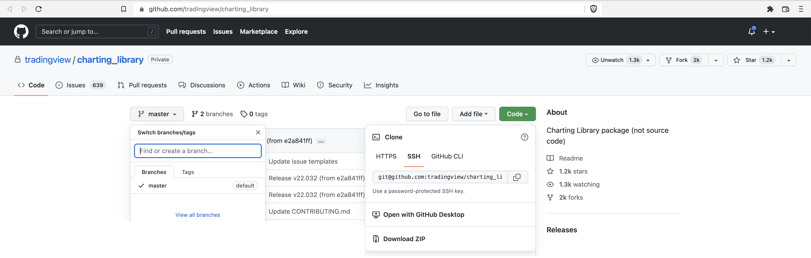

# Updating the library

The following describes how to checkout the main library.

It can be found at this [url](https://github.com/tradingview/charting_library) as shown in the picture below.



Master is released daily.

From here you only have to download a zip file for the desired version and extract the archive to wherever you are going to work.

Once unzipped serve the new directory from the command line as follows

```javascript
npx serve your_new_directory
```

When it’s ready, click on the url. Open Dev Tools and check the version of your library. The version number displayed should be higher & different from your previous one.

Ideally, it’s always best not to override your old version with another one to keep a working version to check against.
Everything that you’ve worked on should still be compatible but we may have tweaked or changed a few things so you should always test your custom work on any versions you update to.
